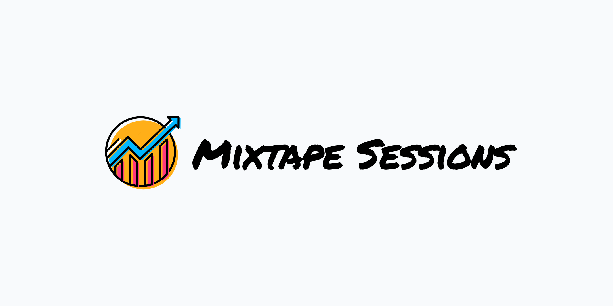

# Mixtape Sessions

Mixtape Sessions aims to provide high-quality and approachable courses in Casual Inference. Multiple times per year our Causal-Inference Democratizer in Chief, [Scott Cunningham](https://scunning.com), hosts our "Mixtape Sessions" which are our flagship, multi-day workshops aimed towards early causal-inference learners. We also welcome researchers working on the frontier of causal inference methods to host "Mixtape Tracks" which are shorter workshops aimed at advanced topics. 

## Online Material

A goal of ours is to create a body of high-quality lecture material that individuals can access *for free* as a byproduct of our company. In this github organization, you will find repositories containing our (growing!) library of workshops. 

## Support and Questions

If you have any questions, please send us an email at [causalinf@mixtape.consulting](mailto:causalinf@mixtape.consulting)!
